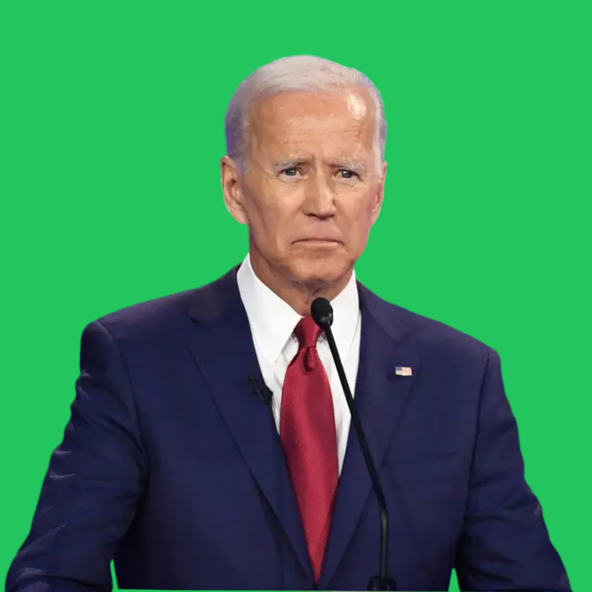

# InsulaAI 🧠
[](https://codespaces.new/zmoustafa/insulaai)

- Insula is an interactive fully autonomous AI twitch streamer
- Insula responds to Twitch chat verbally and with animations
- Insula is live 24/7 at https://www.twitch.tv/insulaai

## Installation Instructions

- Ensure that [Node.js](https://nodejs.org/en) is installed
- Create a .env file in the root directory based on `.env.example`. You will need credentials for OpenAI, Twitch, and Microsoft Azure Speech Services
- Install [pnpm](https://pnpm.io/):

```sh
curl -fsSL https://get.pnpm.io/install.sh | sh -
```

- Install dependencies and start the application:
```sh
pnpm i && pnpm run start
```
- On localhost:3000, a web app will spawn that looks like the following:



- Install [OBS Studio](https://obsproject.com/)
- Select `Browser` Input Source, set it to `http://localhost:3000/`
- Select `Browser`, then, `Filters`, then click `+` in the `Effect Filters` section
- Select `Chroma Key` and set `Key Color Type` to Green. The green background of the web app serves as a green screen for the avatar. 
